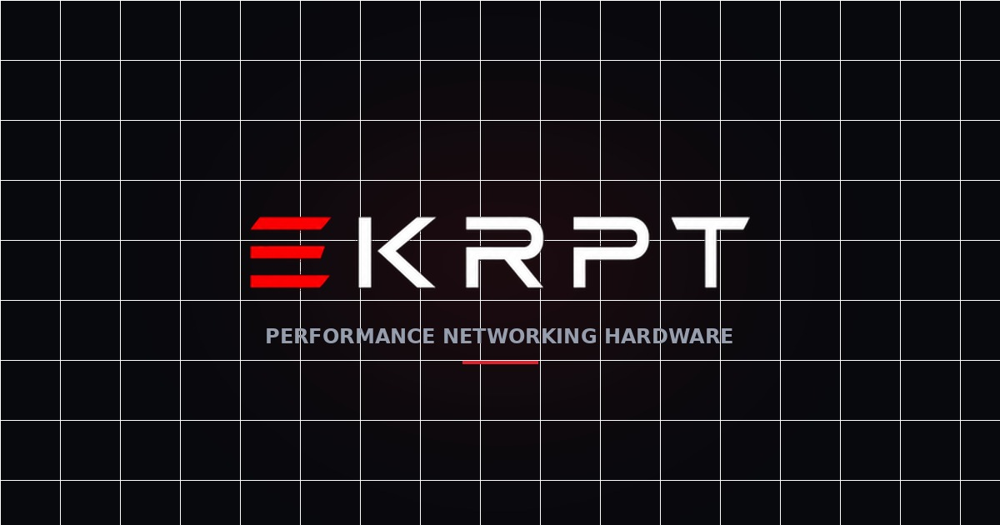

# EKRPT Networking Labs

### Performance Networking Hardware · WiFi 7 · Starlink · Built for Nigeria

---

## 🛰️ About EKRPT

**EKRPT Networking Labs** is a CAC-registered Nigerian technology company specializing in next-generation networking hardware. From our flagship **SPECTRE** router line to official Starlink kits, we engineer and distribute performance connectivity equipment built for speed, low latency, and reliability.

We source, brand, and ship hardware that simply works — whether you're building a competitive gaming setup, a home office, or a multi-site business network. Our mission is straightforward: deliver premium, performance-grade connectivity to homes and businesses across Nigeria and beyond.

> **Brand hierarchy:** EKRPT (company) → SPECTRE (product line) → BE19000 ULTRA (flagship model)

---

## ⚡ Flagship Product — SPECTRE BE19000 ULTRA

Our flagship **WiFi 7 tri-band gaming router**, engineered for esports-grade latency and zero compromise.

| Spec | Detail |
|------|--------|
| **Standard** | WiFi 7 (802.11be) |
| **Bands** | Tri-band (2.4 / 5 / 6 GHz) |
| **Aggregate Speed** | 19,000 Mbps |
| **Uplink** | 10G SFP fibre-ready + 2.5G WAN |
| **LAN** | 3 × 1G |
| **Connectivity** | Dual nano-SIM auto-switch |
| **Features** | MLO · 4096-QAM · 8× antenna · Gaming QoS engine |

---

## 🏪 What We Offer

- 📡 **Starlink Distribution** — Authorized Mini, Gen3 & V4 hardware with full setup support
- 🏷️ **EKRPT-Branded Hardware** — Our own SPECTRE routers & MiFi devices, engineered for real-world conditions
- 🔧 **Installation & Configuration** — On-site and remote setup by our technical team
- 📦 **B2B Supply** — Bulk supply for ISPs, enterprises & resellers at competitive rates

---

## 🛠️ Tech Stack

This storefront is a custom-built e-commerce platform:

| Layer | Technology |
|-------|-----------|
| **Frontend** | Vanilla HTML / CSS / JavaScript |
| **Hosting** | GitHub Pages (custom domain via Namecheap) |
| **Backend** | Supabase (Postgres, Auth, Storage, Edge Functions) |
| **Payments** | PayPal · Cryptomus (crypto) |
| **Email** | Brevo (transactional + auth) |
| **Analytics** | Google Analytics 4 |
| **Design** | Custom "Mission Control" dark theme — Orbitron / Sora / JetBrains Mono |

---

## ✨ Platform Features

- 🛒 Full e-commerce storefront with live cart & checkout
- 💳 Multiple payment gateways (PayPal, crypto) with automated order emails
- 📧 Complete email system — order confirmation, payment, shipping, delivery
- 👥 Staff & role-based access control (RBAC)
- 📝 Built-in blog/CMS for SEO content
- 🔐 Secure authentication with branded email templates
- 📊 Admin dashboard with inventory, orders & analytics
- 🎨 Fully responsive dark-theme design

---

## 📬 Contact

**EKRPT Networking Labs**

*© 2026 EKRPT Networking Labs · CAC Registered · All Rights Reserved*

